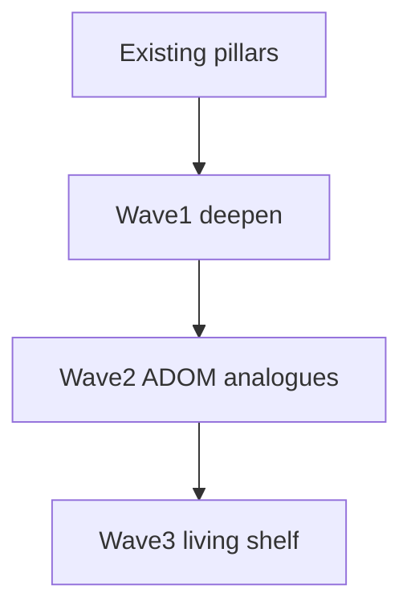

# Extraction Window — ADOM Depth (post-v1)

Roadmap to deepen toward ADOM feature richness **inside** the 15-sector extract spine. No towns, shops, overland, deity alignment, or cross-run meta.

**Canon:** [`V1.md`](V1.md) pillars · [`WORLD.md`](WORLD.md) ecology (scan pressure → EM → fauna) · [`ARCHITECTURE.md`](ARCHITECTURE.md) mechanic registry.

Each wave ships behind autopilot **55–85% WR**.

---

## ADOM → Meridian mapping

| ADOM classic | EW today | Richness target |
|--------------|----------|-----------------|
| Corruption | EM 0–100 + quiet | **Scan scars** at sustained EM-HIGH |
| Hunger | Bus drip | Keep bus primary; fatigue status as soft pressure |
| Identification | Single salvage | Tiered unknowns + biome/scavenger tables |
| Statuses | 4 | 8 with fauna/terrain/EM sources |
| Skills | 3×2 forks | Readable forks; later mastery track |
| Terrain | hazard/vent/scrub | Wave 2: traps, sealed hatches, pools |
| NPC quests | Hail + ally | Wave 2: agendas |
| Crafting | None | Wave 2: 2–3 field recipes |
| Brands | Flat equip | Situational equip tags (Wave 1) |
| Gods / alignment | Out | Soft doctrine later — not deities |
| Weather | Deferred | Wave 3 ion fronts |

---

## Wave 1 — Deepen without new pillars (this pass)

| Ticket | Status |
|--------|--------|
| Status pack: `blind` / `jam` / `fatigue` / `marked` | Done |
| Tiered salvage ID (`salvage` / `sealed_crate` / `array_shard`) | Done |
| Sustained EM-HIGH → scan scars | Done |
| Situational equip tags | Done |
| Re-enable `decode` in room-quest pool | Done |

**Exit gate:** unit + cohere + smoke + balance in band; scars/ID readable in log/HUD.

---

## Wave 2 — Mid-systems (Done)

| Ticket | Status |
|--------|--------|
| Terrain: `sealed` / `tripwire` / `brine_pool` / `scrub_nest` | Done |
| Field craft (sample→filter/ration, shard→balm) | Done |
| NPC agendas (ensign / tech / survey contact) | Done |
| Quiet vs Probe doctrine tallies | Done |
| Fauna `lightPrefer` dark/lit aggro | Done |

**Exit gate:** unit + cohere + smoke + balance in band; optional content never required for extract.

## Wave 3 — Living Shelf

| Ticket | Status |
|--------|--------|
| Elite/boss readable brands + deterministic branded kit drops | Done |
| Branded counter-kit: Flare Prism / Ward Weave / Shadow Lens | Done |
| Companion field roles: drone lamp/intercept + escort cover | Done |
| Ion fronts: mid/late temporary shear, EM/bus pressure, Quiet/filter/flare mitigation | Done |
| Content fattening: `relay_chain` re-enabled midgame with pattern-buffer fail-safe favor | Done |
| Phaser Filters polish | Later |
| Deferred room quests: `calibrate` / `stabilize` | Later |

**Still out:** towns, shops, overland, deity worship, meta unlocks, engine rewrite.

---

## Guardrails

| Rule | Why |
|------|-----|
| `sim/` never imports Phaser | Keep oracle |
| No new Action per gimmick | ARCHITECTURE |
| Autopilot + `test:balance` 55–85% | Don't drown the policy |
| Optional content never required for extract | Causal spine stays clean |
| Lore IDs for every player string | LORE discipline |
| Deepen EM/light/kit before weather | Ecology thesis |

---

## Feel / onboarding

Human starts (`GameScene`) run a short **drill bay** tutorial (`tutorialActive`, `skipTutorial: false`) before real plains — not a 16th campaign sector. Harness / autopilot keep default `skipTutorial: true`. Storm clock and bus drip pause in the bay; hatch exit calls `finishTutorial` → load plains (afterglow fires once).
