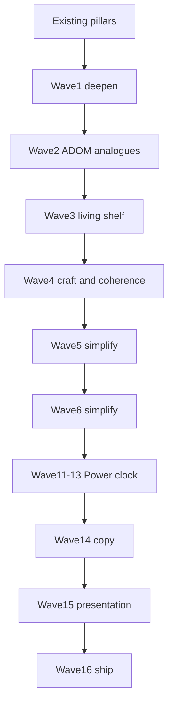

# Extraction Window — ADOM Depth (post-v1)

Roadmap to deepen toward ADOM feature richness **inside** the 15-sector extract spine. No towns, shops, overland, deity alignment, or cross-run meta.

**Canon:** [`V1.md`](V1.md) pillars · [`WORLD.md`](WORLD.md) ecology (scan pressure → EM → fauna) · [`ARCHITECTURE.md`](ARCHITECTURE.md) mechanic registry.

Each wave ships behind autopilot **55–85% WR**.

---

## ADOM → Meridian mapping

| ADOM classic | EW today | Richness target |
|--------------|----------|-----------------|
| Corruption | EM 0–100 + quiet | EM tax + wider fauna aggro (scars tried and cut — see Wave 5) |
| Hunger | Bus drip | Keep bus primary |
| Identification | Single salvage | Biome tables on one salvage kind (tiers tried and cut — see Wave 5) |
| Statuses | 4 | 7 with fauna/terrain/EM sources (`fatigue` cut Wave 6) |
| Skills | 3×2 forks | Readable forks; later mastery track |
| Terrain | hazard/vent/scrub/sump + sealed hatch caches | Further traps as needed |
| NPC quests | Hail + ally | Wave 2: agendas |
| Crafting | None | Wave 2: 2–3 field recipes |
| Brands | Flat equip | Situational equip tags; paper doll loadout (Waves 19–22) |
| Gods / alignment | Out | Doctrine tried and cut — see Wave 5 |
| Weather | Deferred | Wave 3 ion fronts |

---

## Wave 1 — Deepen without new pillars (this pass)

| Ticket | Status |
|--------|--------|
| Status pack: `blind` / `jam` / `marked` (`fatigue` cut Wave 6) | Done |
| Tiered salvage ID (`salvage` / `sealed_crate` / `array_shard`) | Shipped, **cut in Wave 5** |
| Sustained EM-HIGH → scan scars | Shipped, **cut in Wave 5** |
| Situational equip tags | Done |
| Re-enable `decode` in room-quest pool | Shipped, **cut in Wave 5** |

**Exit gate:** unit + cohere + smoke + balance in band; scars/ID readable in log/HUD.

---

## Wave 2 — Mid-systems (Done)

| Ticket | Status |
|--------|--------|
| Terrain: `sealed` / `tripwire` / `sump` / `scrub_nest` | Done |
| Field craft (sample→filter/ration, shard→balm) | Shipped, **cut in Wave 5** |
| NPC agendas (ensign / tech / survey contact) | Done |
| Quiet vs Probe doctrine tallies | Shipped, **cut in Wave 5** |
| Fauna `lightPrefer` dark/lit aggro | Done |

**Exit gate:** unit + cohere + smoke + balance in band; optional content never required for extract.

## Wave 3 — Living Shelf

| Ticket | Status |
|--------|--------|
| Elite/boss readable brands + deterministic branded kit drops | Done |
| Branded counter-kit: Flare Prism / Ward Weave / Shadow Lens | Shipped, **cut in Wave 5** (folded onto core kit) |
| Companion field roles: drone lamp/intercept + escort cover | Done |
| Ion fronts: mid/late temporary shear, EM/bus pressure, Quiet/filter/flare mitigation | Done |
| Content fattening: `relay_chain` re-enabled midgame with pattern-buffer fail-safe favor | Shipped, **cut in Wave 5** |
| Deferred room quest: `calibrate` re-enabled late-mid/late with storm-shelter favor | Shipped, **cut in Wave 5** |
| Deferred room quest: `stabilize` re-enabled midgame with hazard-pass favor | Shipped, **cut in Wave 5** |
| Phaser Filters polish: optional built-in camera vignette + flare/ion/extract pulses | Done |

**Still out:** towns, shops, overland, deity worship, meta unlocks, engine rewrite.

**Wave 3 complete.** Camera filters are WebGL-only atmosphere; unsupported renderers keep the existing
Graphics/tint/light presentation. Sim light and FOV remain the gameplay source of truth.

### Relevance pass

Sealed hatches now refund a small storm window; brands alter flare, ion, and dark-aggro behavior;
ion fronts and contamination have clearer, sharper taxes; and optional quest
favor previews make their thresholds and rewards visible. Texture-only scripted pulses were removed;
the optional quest route remains outside the extraction spine.

---

## Wave 4 — Craft & Coherence (mostly done)

Depth of *craft* rather than new systems: lock the filters, bind optional text to real rooms, and make the mastery paths fail differently. Sourced from a design review against the sibling project `ruin-protocol`.

| Ticket | Status |
|--------|--------|
| Scope filter doc ([`GEM.md`](GEM.md)) + land [`DESIGN_PRINCIPLES.md`](DESIGN_PRINCIPLES.md) on main | Done |
| Doc drift: PLAN harness-only + Phaser 4; V1 quest table matches `pickRoomQuestKind` | Done |
| Locked look ([`art/ART_BIBLE.md`](art/ART_BIBLE.md)) — palette/emitter owners, chrome budget, rejects | Done |
| Feel debt: Shift-peek / peek-teach | **Cut** — not on main; see Wave 24 |
| Notice Impact (experiment branch) | **Out of scope** — optional presentation only |
| `GameScene` shrink — extract remaining orchestration to presenters | **Done** — `TurnPresenter.ts`, `FieldLighting.ts`, `ActorSync.ts` (~1,600 lines) |
| Oracle telemetry: peak EM, IDs used, stuck reason codes | Done |
| Reporting personas (`stable` / `quiet` / `probe` / `reckless`) via `playtest --personas` | Done |
| Room facts → optional text binds to what is actually in the room; `cohere` fails unbound and unreachable pages | Done |
| Distinct failure modes per path (GEM §2) | **Improved post–Wave 11–13** — hp ~57%, energy ~25% on 500-seed probe; see Waves 11–13 |

### Path-failure measurement (historical → current)

Pre–Wave 11: full suite on `stable` **19/30 (63%)**, hp 8 · storm 3 · energy 0 · stuck 0 — one channel owned **73%** of deaths. Persona sweep showed the same shape on every path.

Waves 11–13 closed the structural issues:
- **Storm channel removed** — no turn timer; exploration viable.
- **Power is a real spend clock** — kit burns and sector drip produce energy losses (~25% of held-out probe losses).
- **hp dominance eased** — ~57% on 500 held-out seeds (was ~75% pre–Wave 11).

Still open: **stuck ~18%** of held-out probe losses — watch before tag; human play may differ from autopilot turn caps.

Do **not** retune from the oracle alone: pair with human play, and re-gate `test:balance` after each step.

**Not in Wave 4/5** (reviewed and rejected as wrong-project imports): React/Zustand HUD, fullscreen SDF or clustered lighting, cyber-psychosis / mutation fantasy, WFC megastructure generation, hub-every-5-sectors spine, cross-run meta of any kind.

**Exit gate:** unit + cohere + smoke + balance in band; no new always-on chrome; optional content still never required for extract.

---

## Wave 5 — Simplify (done)

Waves 1–3 added richness faster than the game added *decisions*. Wave 5 cuts anything the player
could not see, could not choose, or would always answer the same way. The 15-sector spine, the
clocks, light, EM and the skill forks are untouched.

| Cut | Why |
|-----|-----|
| Scan scars | Needed 12 consecutive end-turns at EM 65; observed peak never passed 50, so no run ever saw one |
| POI system (console / nest / cache scar) | Spawned only when no room quest existed, but a quest always builds at 3+ rooms — **0 of 600** generated maps had one. The tile is now a decorative `landmark` |
| Doctrine tallies (quiet vs probe) | Counted silently and nudged a handful of numbers; never surfaced, never chosen |
| Tiered identify + field craft | Three fail rates and two recipes teaching the same lesson three times |
| Branded counter-kit + 14 other item kinds | 32 kinds → **18**, one clear tool per job; retired kinds fold onto the survivor that did their work |
| Utility equip slot | Third slot held whatever was left over |
| Four room quests (`decode`, `relay_chain`, `stabilize`, `calibrate`) | 7 kinds → **3**, one per resource: salvage bills Window, purge bills HP, vent_seal bills kit |
| `get` and `retreat` verbs | Pickup is now automatic on step; retreat spent 4 Bus to do what a free step already did |
| Surplus salvage → Window time | Paid the player for hoarding junk, invisibly, and never once fired in a measured run |

**Added, not cut:** plating re-seats in full at each hatch. Armor had been a one-time buffer that only
`plate` could refill, so it sat at zero for most of a run while hp took three quarters of all deaths.
It is now a per-sector shield the player can plan around.

**Result:** 63% WR on the 30-seed gate, **66.5%** over 200 fresh seeds (pre-cut baseline measured
59.5% on the same 200), hp losses down from 71/200 to 46/200. `cohere` reports 15 sectors, 22
enemies, 18 items.

**Lesson for future waves:** the 30-seed gate is a regression check, not a measurement — it was
mildly overfit (63% vs 59.5% true). Removing content shifts RNG consumption, so seeds land in
different worlds and per-seed comparisons across a refactor are meaningless. Measure aggregates on a
few hundred fresh seeds before concluding a change helped or hurt.

---

## Wave 6 — Simplify (done)

Cut systems the player could not choose or always answered the same way. Pillars, Quiet, room
quests, NPCs/allies, skills, and the extract spine stay.

| Cut | Why |
|-----|-----|
| Survey soft refunds (mid-room + hatch explore%) | Always-answer explore → Window/XP; same class as Wave 5 surplus-salvage refund |
| `fatigue` status + harness cancel tag | RNG Bus tax whose only answer was “wear harness”; harness keeps +6 shield capacity |
| `emHighStreak` | Only fed the fatigue roll after scars were cut |
| `progressStormTax` / `progressEnergyTax` stubs | Always off; dead call sites |

**Rewires / copy:** `survey_contact` agenda requires a Nav Ping only. Stale teaching fixed (`press g`,
`counter-kit`, Quiet-as-EM-flush).

**Exit gate:** unit + cohere + smoke; WR stays in the 55–85% band.

---

## Guardrails

| Rule | Why |
|------|-----|
| `sim/` never imports Phaser | Keep oracle |
| No new Action per gimmick | ARCHITECTURE |
| Autopilot + `test:balance` 55–85% | Don't drown the policy |
| Optional content never required for extract | Causal spine stays clean |
| Lore IDs for every player string | LORE discipline |
| Deepen EM/light/kit before weather | Ecology thesis |

---

## Feel / onboarding

Human starts (`GameScene`) run a short **drill bay** tutorial (`tutorialActive`, `skipTutorial: false`) before real plains — not a 16th campaign sector. Harness / autopilot keep default `skipTutorial: true`. Storm clock and bus drip pause in the bay; hatch exit calls `finishTutorial` → load plains (afterglow fires once).

## Wave 7 — Cut Quiet stance

Removed the EM Scrambler / Quiet stance system end-to-end (item, `jammerTurns`, FOV/lamp dim, mite silence, EM-HIGH suppress, ion Quiet shield, QUIET badge). Field light remains LIT/SHADOW + flare. Autopilot persona id `quiet` kept as a conservative flare-hoard profile only.

Finding #1 (Quiet as mandatory tax) is closed by deletion rather than retune — expect WR to need a follow-up measure.

---

## Wave 8 — Clocks you can read (done)

The Wave 7 follow-up measure, plus what it turned up. Three parts: fix the gate that
missed it, make the Window honest, retune what the measurement blamed.

### The gate was not measuring

`test:balance` ran 30 hand-picked seeds — about ±18 points — and reported green at a
true **52.6% ±4.4** (500 fresh seeds), below the 55% floor. Wave 5 predicted exactly this
("the 30-seed gate is a regression check, not a measurement"); it took a pillar-level cut
to expose it. The gate now runs **300 generated seeds** (`GATE_SEEDS`), deliberately
offset from `scripts/probe-wr.ts` so that probe stays a held-out measurement.

### The Window was lying

Window burn was never 1 unit per turn: `tickEnvironment` taxed it from sector 8 and again
from 11, so a vault turn cost **2.5**. The HUD went on printing raw units. Reading
"240 left" in the vault meant **96 turns**, and the low-Window warning fired 80 turns out
on the flats but 32 turns out deep in the spine, where notice is worth most.

Drain now resolves in one place (`src/sim/window.ts`). The readout counts turns and names
the rate (`Window x2.5`), warnings fire on turns remaining, and crossing into a taxed
sector says so at the hatch (`LOG-WINDOW-TAX`).

### Peak tax moved off the vault

New probe (`scripts/probe-loss.ts`) charges every turn to the sector it was spent in.
The vault was the most expensive sector in **17 of 44** Window losses at a median 55 turns
against a winner's 29 — and the vault is where the Nav Lattice is. The spine was charging
its steepest clock rate for doing the one thing it requires. Heavy tax now starts at the
fissure (12), so urgency lands on the run home.

**Result:** **59.2% ±4.3** over 500 fresh seeds, back in band. Storm losses 81 → 42.

### Open, and now visible

- **hp owns 75% of deaths** (154/204). It was 63% before this wave, but only because a
  misplaced Window tax was killing people — the hp *count* barely moved (148 → 154). The
  Wave 4 death-mix finding was never fixed, only masked. Flat plating buffs measured inside
  noise; Wave 9 sharpens the fauna tax instead of adding a Quiet replacement.
- **The Bus clock is structurally dead** (8/500 losses). Every energy change in the
  codebase is a tax applied *to* the player; no action spends Bus by choice. It is a slow
  damage type wearing a clock's name.
- **The autopilot never reads `stormTurns`.** It cannot rush a closing Window, so it
  over-reports storm deaths relative to a human who can. Treat any Window retune measured
  on the oracle as a lower bound and pair it with human play.

**Exit gate:** unit + cohere + smoke + 300-seed band gate green; no new always-on chrome.

---

## Wave 9 — Sharpen the fauna tax (done)

Combat is not the skill pillar (clocks + light are), but the extract spine still forces
bump fights. Pre-wave fauna was soft behind plating (`difficulty.ts` was explicitly
“HP more than ATK”), so engages felt like sponge work rather than a consequence of bad
light or open ground.

### What shipped

| Lever | Change |
|-------|--------|
| ATK depth | Steeper than HP (`0.04`/sector + `0.012`/level vs HP `0.035` + `0.01`) so mid/late hits clear DEF and chew plating; HP held soft so fights stay short |
| Flank peel | Cap `2` → `3` — open-floor packs read harsher than a doorway duel |
| lightPrefer | Preferred-light side amplified (+1); wrong-light penalties left as they were so lit-prefer fauna still hold range in the dark |

### Measured out

A one-shot **first-contact +2 ATK** on every hostile’s first melee, stacked with the full
ATK curve and full lightPrefer amplify, dropped the held-out probe to **49–51%**. Dialed
out rather than kept as a permanent difficulty layer.

### Result

**57.8% ±4.3** over 500 fresh seeds (Wave 8 baseline 59.2%). Lose mix `hp=161 storm=43
energy=7` — hp still dominates (~76% of losses), which matches “combat is a path tax,
not a solved channel.” 300-seed band gate green; smoke green.

### Still open

- Bus still has no player spend (Wave 8 finding).
- Autopilot still ignores `stormTurns`.
- No Quiet replacement — intentional: deepen the wake tax, don’t re-add a mandatory stance.

**Exit gate:** unit + cohere + smoke + 300-seed band gate green; no new combat verbs.

---

## Wave 10 — Deepen existing combat

No new verbs. Packs queued on one approach tile so flank peel almost never fired;
preferred-light +1 lived only on aggro range. This wave makes those rules happen
in the bump.

| Lever | Change |
|-------|--------|
| Pack seats | Hunters close on distinct contact tiles instead of stacking behind the first body. Cap **two** seats — a third queues. Four simultaneous bites dropped the 300-seed gate to 51%. |
| lightPrefer ATK | Dark-prefer +1 in SHADOW. Lit-prefer stays an aggro-range cue (true-LIT +1 was a flat wasp buff on the lamp tile). |
| Brand hint | One-shot coach — stop hogging the hint line whenever an elite is visible |
| Read | Incoming flank seats paint on the ground from `chosenFlankSeat`. Hint stays while boxed. SHADOW +1 float when dark-prefer bonus pays out. |

Still out: first-contact ATK, Quiet, brace/shove.

### Result

**58.3% ±5.6** over the 300-seed band gate (175/300). Lose mix `hp=95 storm=27 energy=3`
— hp still ~76% of losses. Smoke 6/8; full playtest 23/30 (77%). Unit 316.

**Exit gate:** unit + smoke + playtest + 300-seed band gate green; no new combat verbs.

---

## Waves 11–13 — Power-only clock (done)

**Design shift:** dual clocks (Window + Power) → **Power is the only death clock**. Exploration is allowed; pressure comes from Power management (sector drip, hazards, kit spends) and exploration tax (EM, wake/fauna, optional quests billing HP/kit — not time).

### Wave 11 — Remove Window

- Deleted `stormTurns`, `src/sim/window.ts`, storm lose channel, Window HUD bar, `storm_shelter` favor, `last_window` skill.
- Handshake / pattern fail → **Power tax** (−8). Salvage quest pays **kit/XP only**.
- Shear dial → Power reserve + EM (`ShearPressure.ts`); music mood from sector depth + combat + Power critical.

### Wave 12 — Power as real clock

- Kit spends: probe −3, flare −2, filter −1, stim −2, phaser −4.
- Late-spine sector drip +1 (brine, vault, fissure, approach). Autopilot `canBurnKit()` reserves Power headroom before optional kit use.

### Wave 13 — Exploration without rush

- Optional quests and mapping viable — no hard turn cap.
- Persona sweep targets **hp vs energy** only; storm channel = 0.
- Docs: `V1.md` pillar shift; this section.

### Presentation follow-ups (same arc, not gated on WR)

- Modal overlays block gameplay keys (`InputController` modal-first routing) — **done**.
- Salvage pickup floats `STOWED · {item}` with cap-pin on noisy turns — **done** (uncommitted at doc time).

### Result

| Check | Result |
|-------|--------|
| 300-seed band gate | PASS — in 55–85% band |
| Held-out probe (500 seeds) | **66.2% ±4.1** WR; avg turns ~448 |
| Lose mix (500 probe) | `hp=97 energy=42 stuck=30` — hp ~57%, energy ~25%, stuck ~18% of losses |
| Smoke | PASS — storm channel 0 |
| Unit | PASS — 394 tests |

**Closed:** Wave 8 finding #2 (Bus has no player spend). Storm clock and autopilot `stormTurns` blind spot.

**Still open:** Stuck rate on held-out probe (watch metric; Wave 18 hardening).

**Exit gate:** unit + cohere + smoke + 300-seed band green — **met**.

---

## Wave 14 — Copy coherence (done)

Sim rules are Power-only; this wave aligned lore, help, PADD, and float labels.

| Ticket | Status |
|--------|--------|
| Lore audit | Done — `src/data/lore.ts` Power-only voice |
| Help / drill / HUD | Done — single Power clock + exploration pressure section |
| Stale rewards | Done — elite/NPC/agenda copy; sealed cache float |
| Sector briefs | Done — fissure/approach tax **Power** |
| `cohere` / unit gate | Done — `loreClockGuard.ts` + `tests/data/loreClock.test.ts` |

**Exit gate:** grep-clean player lore for clock lies — **met**.

---

## Wave 15 — Presentation debt (done)

| Ticket | Status |
|--------|--------|
| `GameScene` shrink — HUD chrome + shear readout | Done — `HudChrome.ts`, `ShearReadout.ts` |
| Wake tells + Survey Phaser UX | Done — `WakeTells.ts`, `PhaserLanes.ts` |
| HUD de-duplication (EM, skill pick, extract chips) | Done |
| Human feel (main-only checklist) | Done — oracle + presenter unit tests; browser spot-check |

**Exit gate:** GameScene not growing without extract — **met** (Wave 17).

---

## Wave 16 — Ship tag (done)

| Ticket | Status |
|--------|--------|
| Oracle | **65.2% ±4.2** WR (500-seed probe); stuck **5.8%** of runs / **~17%** of losses |
| Doc sync | V1 / ADOM / PLAN updated |
| Tag | **`v1.0.0`** |

**Exit gate:** `test:balance` green; copy coherent — **met**.

---

## Wave 17 — GameScene shrink (done)

| Ticket | Status |
|--------|--------|
| Turn pipeline | `TurnPresenter.ts` |
| Field lighting pass | `FieldLighting.ts` |
| Actor / item / goal sync | `ActorSync.ts` |
| `GameScene.ts` line count | ~**1,600** (from ~2,289) |

---

## Wave 18 — Stuck hardening (done)

| Ticket | Status |
|--------|--------|
| `unstickAction` — handshake wait, melee blockers, salvage burn | Done |
| Cap-pressure fallback in `runAutopilot` | Done |
| Unit tests | `autopilot.test.ts` |

**Exit gate:** stuck share monitored on 500-seed probe after policy change.

---

## Wave 19 — Paper doll structure (done)

| Ticket | Status |
|--------|--------|
| `EquipSlotId` — head, suit, hands, tool, feet, comm, ring_l, ring_r | Done |
| Rename equip `armor` → `suit`; vitals `armor` stat unchanged | Done |
| Helpers — `src/sim/equip.ts`, `isItemWorn`, `resolveEquipTarget` | Done |
| Kit overlay — worn loadout column + bag list | Done |

**Exit gate:** zero balance change from empty slots; band unchanged.

---

## Wave 20 — Comm slot (done)

| Ticket | Status |
|--------|--------|
| `field_comm` → comm slot | Done |
| NPC agenda hail range 2 tiles when comm worn | Done |
| Optional midgame loot (sector tables + sealed cache) | Done |

**GEM:** trades kit space for readable NPC agenda pressure before Power runs out.

---

## Wave 21 — Ring + head (done)

| Ticket | Status |
|--------|--------|
| `scan_band` — lower salvage fail at EM-HIGH | Done |
| `survey_visor` — blind/jam −1 tick; FOV −1; shadow-flare EM tax | Done |
| Elite / deep loot tables | Done |

---

## Wave 22 — Hands + feet (done)

| Ticket | Status |
|--------|--------|
| `grip_gloves` — hazard step skips ion burn | Done |
| `mag_boots` — hazard/brine Power −1; tripwire EM −1 | Done |
| Brine / duct / fissure loot bias | Done |

**Tag:** `v1.1.0` when build + playtest green.

---

## Wave 23 — Branded wearables (done)

| Ticket | Status |
|--------|--------|
| Tag lookup refactor — `equipTags.ts` (`wornTagSum`, `wornTagMax`, `slotTag`) | Done |
| Elite drops — Flare Prism / Ward Weave / Shadow Lens replace consumable `brandDrop` | Done |
| Sim hooks — flare cost/mark, weave ion/vent, lens notice/status | Done |
| Autopilot — equip branded piece when matching elite visible | Done |
| Unit — `brandedWear.test.ts` | Done |

**GEM:** each branded wearable trades kit space for one readable brand-counter pressure.

**Tag:** `v1.2.0` when `test:balance` green.

---

## Wave 24 — UI/doc sync (done)

| Ticket | Status |
|--------|--------|
| Kit two-column overlay + scroll + equip detail | Done |
| Title minimal chrome; dock legend; skills chip | Done |
| Kit overflow fix (panel height from wrapped lines) | Done |
| Peek purge — Shift-peek cut in canon + experiment README | Done |
| ADOM / V1 / PLAN wave list sync | Done |

**Tag:** `v1.2.1` — presentation-only.

---

## Wave 25 — Clearer optional quests (done)

| Ticket | Status |
|--------|--------|
| Kind / cost / payoff on HUD quest line | Done |
| Purge stage prompts (wake → clear → claim) | Done |
| Remote coaching hint + sector-enter brief | Done |
| Help: amber dashed frame = optional site | Done |

---

## Wave 29 — Loadout readout (done)

| Ticket | Status |
|--------|--------|
| `equipTagLines` + net loadout summary in kit | Done |
| HUD loadout chip (net tag tradeoffs) | Done |

---

## Wave 30 — Cache economy (done)

| Ticket | Status |
|--------|--------|
| `wearableLootForSector` — biome cache/hazard bias | Done |
| Sealed hatch depth gloves/boots roll | Done |

---

## Wave 31 — Sector survey (done)

| Ticket | Status |
|--------|--------|
| Cache room looted tracking + sector clear log/XP | Done |
| Mapper ping nearest unlooted cache | Done |

---

## Wave 32 — Quest & hunt payouts (done)

| Ticket | Status |
|--------|--------|
| Salvage quest wearable roll (sector ≥ 6) | Done |
| Comm worn → cache bearing hint once/sector | Done |
| Elite minimap pip when explored | Done |

---

## Wave 26 — Presentation depth (done)

| Ticket | Status |
|--------|--------|
| EndScene loadout + skills summary on title-kit plate | Done |
| Shear accent strip left of POWER/EM text | Done |
| Breaching mote spike + stronger breach camera cue | Done |

**Suggested tag after Waves 25–32:** `v1.3.0` when balance green.

---

## Wave 27 — Balance hygiene (skipped)

Playtest after Wave 26 closeout: **21/30 (70%)**, stuck=1 (~11% of losses), hp+energy both present, dominant channel 56%. Within band — **no retune**.

---

## Wave 28 — Ship (done)

| Ticket | Status |
|--------|--------|
| Vite `base: './'` for Pages / itch relative assets | Done |
| `.github/workflows/deploy.yml` on `main` + `v*` tags | Done |
| Cohere item count lock (26) | Done |
| Tag `v1.3.0` | Done |

---

## Waves 33–42 — Presentation wrap (done)

Chrome honesty and glance readability after ART_BIBLE §8 closeout. No Notice Impact, peek, or balance retune.

| Wave | Ticket | Status |
|------|--------|--------|
| 33 | Title/End `drawMenuPlate` parity + Title vignette | Done |
| 34 | Shear hazard tape + pulsing leg glyphs | Done |
| 35 | Quest vs cache pressure motifs; landmarks silent | Done |
| 36 | HUD chip priority + `+N` overflow (`HUD_BADGE_SLOTS`) | Done |
| 37 | Kit section plates + Power trough meter | Done |
| 38 | Minimap kit chrome + quest/cache/elite pips | Done |
| 39 | One-line shear escalate / breach stings (`m` mute) | Done |
| 40 | Contact sheet chrome + pressure motif QA | Done |
| 41 | Meridian hostile/note display names | Done |
| 42 | Dead `hush` profile removed; Pages `base: './'` confirmed | Done |

**Tag:** `v1.4.0` — presentation-only.

---

## Waves 43–50 — Graphics & animation (done)

Motion and light-as-matter after the chrome wrap. No Notice Impact, peek, scanline restore, or balance retune. Perf stays on the 420ms tick, dirty hop wash, and ~8× bloom.

| Wave | Ticket | Status |
|------|--------|--------|
| 43 | Flare/beacon ignite at emitter + first-light front bloom | Done |
| 44 | Behavior-linked hostile deluxe frames | Done |
| 45 | Windup-synced ThreatView pulse + beam travel + dashed site | Done |
| 46 | Melee tint flash, phaser spine, phaser camera snap | Done |
| 47 | Arcing/Breaching field crush in tile tint (no scanline) | Done |
| 48 | Prop 4-frame deluxe + bloom pulse + crack flicker | Done |
| 49 | Sector-enter bloom + handshake ignite (one live Graphic) | Done |
| 50 | Sheet animation QA + ART_BIBLE motion/perf rules | Done |

**Tag:** `v1.5.0` — presentation-only.

---

## Waves 51–58 — Graphical presentation (done)

Loot/ally readability, ion-front and status field language, modal chrome parity, wake/goal instruments, handshake/mapper spatial tells. No Notice Impact, peek, scanline restore, or balance retune. Perf stays on the 420ms tick, dirty hop wash, mote caps, and one live ignite Graphic.

| Wave | Ticket | Status |
|------|--------|--------|
| 51 | Ground loot kind silhouettes + sheet row | Done |
| 52 | Ion-front field tint/mote language | Done |
| 53 | Ally/NPC 3-frame motion + setTexture-on-change | Done |
| 54 | Blind/jam/marked diegetic wash | Done |
| 55 | Help/PADD/Changelog plated modal parity | Done |
| 56 | Wake Breaching weight + goal animFrame pulse | Done |
| 57 | Handshake pad sync ticks + mapper memory wash | Done |
| 58 | Sheet QA, docs, `GAME_VERSION`, tag `v1.6.0` | Done |

**Tag:** `v1.6.0` — presentation-only.

---

## Waves 59–60 — Field ear + sector identity (done)

Audio honesty after the graphics pack, plus layout-grammar identity without new systems. No Notice Impact, peek, Window restore, or balance retune target — WR stays in band via existing gates.

| Wave | Ticket | Status |
|------|--------|--------|
| 59 | Music moods: `storm` → `shear`; beds track Power / shear dial / ion front; **per-biome bed colour** (rate/band/shear underlay); pillar SFX; grammar hatch-enter stings | Done |
| 60 | Ambient grammar overlays; room-role tilt + dress density by layout; wearable cache bait folds grammar cue; docs + `v1.7.0` | Done |

**Tag:** `v1.7.0` — audio + sector identity.

---

## Explicit defer (post-v1)

Art retheme, full audio asset rewrite (new beds beyond rename), campaign-length change, Godot/Unity port, meta progression, towns/shops, cross-run unlocks, Window clock restoration.
