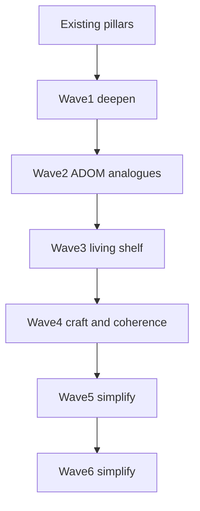

# Extraction Window — ADOM Depth (post-v1)

Roadmap to deepen toward ADOM feature richness **inside** the 15-sector extract spine. No towns, shops, overland, deity alignment, or cross-run meta.

**Canon:** [`V1.md`](V1.md) pillars · [`WORLD.md`](WORLD.md) ecology (scan pressure → EM → fauna) · [`ARCHITECTURE.md`](ARCHITECTURE.md) mechanic registry.

Each wave ships behind autopilot **55–85% WR**.

---

## ADOM → Meridian mapping

| ADOM classic | EW today | Richness target |
|--------------|----------|-----------------|
| Corruption | EM 0–100 + quiet | EM tax + wider fauna aggro (scars tried and cut — see Wave 5) |
| Hunger | Bus drip | Keep bus primary |
| Identification | Single salvage | Biome tables on one salvage kind (tiers tried and cut — see Wave 5) |
| Statuses | 4 | 7 with fauna/terrain/EM sources (`fatigue` cut Wave 6) |
| Skills | 3×2 forks | Readable forks; later mastery track |
| Terrain | hazard/vent/scrub + sealed hatch caches | Further traps / pools as needed |
| NPC quests | Hail + ally | Wave 2: agendas |
| Crafting | None | Wave 2: 2–3 field recipes |
| Brands | Flat equip | Situational equip tags (Wave 1) |
| Gods / alignment | Out | Doctrine tried and cut — see Wave 5 |
| Weather | Deferred | Wave 3 ion fronts |

---

## Wave 1 — Deepen without new pillars (this pass)

| Ticket | Status |
|--------|--------|
| Status pack: `blind` / `jam` / `marked` (`fatigue` cut Wave 6) | Done |
| Tiered salvage ID (`salvage` / `sealed_crate` / `array_shard`) | Shipped, **cut in Wave 5** |
| Sustained EM-HIGH → scan scars | Shipped, **cut in Wave 5** |
| Situational equip tags | Done |
| Re-enable `decode` in room-quest pool | Shipped, **cut in Wave 5** |

**Exit gate:** unit + cohere + smoke + balance in band; scars/ID readable in log/HUD.

---

## Wave 2 — Mid-systems (Done)

| Ticket | Status |
|--------|--------|
| Terrain: `sealed` / `tripwire` / `brine_pool` / `scrub_nest` | Done |
| Field craft (sample→filter/ration, shard→balm) | Shipped, **cut in Wave 5** |
| NPC agendas (ensign / tech / survey contact) | Done |
| Quiet vs Probe doctrine tallies | Shipped, **cut in Wave 5** |
| Fauna `lightPrefer` dark/lit aggro | Done |

**Exit gate:** unit + cohere + smoke + balance in band; optional content never required for extract.

## Wave 3 — Living Shelf

| Ticket | Status |
|--------|--------|
| Elite/boss readable brands + deterministic branded kit drops | Done |
| Branded counter-kit: Flare Prism / Ward Weave / Shadow Lens | Shipped, **cut in Wave 5** (folded onto core kit) |
| Companion field roles: drone lamp/intercept + escort cover | Done |
| Ion fronts: mid/late temporary shear, EM/bus pressure, Quiet/filter/flare mitigation | Done |
| Content fattening: `relay_chain` re-enabled midgame with pattern-buffer fail-safe favor | Shipped, **cut in Wave 5** |
| Deferred room quest: `calibrate` re-enabled late-mid/late with storm-shelter favor | Shipped, **cut in Wave 5** |
| Deferred room quest: `stabilize` re-enabled midgame with hazard-pass favor | Shipped, **cut in Wave 5** |
| Phaser Filters polish: optional built-in camera vignette + flare/ion/extract pulses | Done |

**Still out:** towns, shops, overland, deity worship, meta unlocks, engine rewrite.

**Wave 3 complete.** Camera filters are WebGL-only atmosphere; unsupported renderers keep the existing
Graphics/tint/light presentation. Sim light and FOV remain the gameplay source of truth.

### Relevance pass

Sealed hatches now refund a small storm window; brands alter flare, ion, and dark-aggro behavior;
ion fronts and contamination have clearer, sharper taxes; and optional quest
favor previews make their thresholds and rewards visible. Texture-only scripted pulses were removed;
the optional quest route remains outside the extraction spine.

---

## Wave 4 — Craft & Coherence (in progress)

Depth of *craft* rather than new systems: lock the filters, bind optional text to real rooms, and make the mastery paths fail differently. Sourced from a design review against the sibling project `ruin-protocol`.

| Ticket | Status |
|--------|--------|
| Scope filter doc ([`GEM.md`](GEM.md)) + land [`DESIGN_PRINCIPLES.md`](DESIGN_PRINCIPLES.md) on main | Done |
| Doc drift: PLAN harness-only + Phaser 4; V1 quest table matches `pickRoomQuestKind` | Done |
| Locked look ([`art/ART_BIBLE.md`](art/ART_BIBLE.md)) — palette/emitter owners, chrome budget, rejects | Done |
| Feel debt: peek-teach yields to drill/tele hints; Notice Impact chase latch | Done — plus a single `resolveHintLine` channel so Escape cannot burn an unseen tip |
| `GameScene` shrink — extract remaining orchestration to presenters | Pending |
| Oracle telemetry: peak EM, IDs used, stuck reason codes | Done |
| Reporting personas (`stable` / `quiet` / `probe` / `reckless`) via `playtest --personas` | Done |
| Room facts → optional text binds to what is actually in the room; `cohere` fails unbound and unreachable pages | Done |
| Distinct failure modes per path (GEM §2) | **Measured — tuning deferred**, see below |

### Path-failure measurement (first read)

Full suite on `stable`: **19/30 (63%)**, hp 8 · storm 3 · energy 0 · stuck 0 — one channel owns **73%** of deaths. The persona sweep (`playtest --personas`) showed the same shape on every path, which is what set up Wave 5.

Two findings survive the Wave 5 cut and are still open:

1. **Quiet is not one option among several — it is the tax you must pay.** Dropping the jammer (`probe` persona) costs 12 points of win rate and makes deaths **100%** hp. That is a single curve with a mandatory item, not a real choice.
2. **The bus clock is nearly dead as a channel.** Only `reckless` ever produced an energy loss. Bus pressure currently converts into hp deaths instead of its own failure.

Do **not** retune these from the oracle alone: the personas are reporting instruments. Pair the retune with human play, and re-gate `test:balance` after each step.

**Not in Wave 4/5** (reviewed and rejected as wrong-project imports): React/Zustand HUD, fullscreen SDF or clustered lighting, cyber-psychosis / mutation fantasy, WFC megastructure generation, hub-every-5-sectors spine, cross-run meta of any kind.

**Exit gate:** unit + cohere + smoke + balance in band; no new always-on chrome; optional content still never required for extract.

---

## Wave 5 — Simplify (done)

Waves 1–3 added richness faster than the game added *decisions*. Wave 5 cuts anything the player
could not see, could not choose, or would always answer the same way. The 15-sector spine, the
clocks, light, EM and the skill forks are untouched.

| Cut | Why |
|-----|-----|
| Scan scars | Needed 12 consecutive end-turns at EM 65; observed peak never passed 50, so no run ever saw one |
| POI system (console / nest / cache scar) | Spawned only when no room quest existed, but a quest always builds at 3+ rooms — **0 of 600** generated maps had one. The tile is now a decorative `landmark` |
| Doctrine tallies (quiet vs probe) | Counted silently and nudged a handful of numbers; never surfaced, never chosen |
| Tiered identify + field craft | Three fail rates and two recipes teaching the same lesson three times |
| Branded counter-kit + 14 other item kinds | 32 kinds → **18**, one clear tool per job; retired kinds fold onto the survivor that did their work |
| Utility equip slot | Third slot held whatever was left over |
| Four room quests (`decode`, `relay_chain`, `stabilize`, `calibrate`) | 7 kinds → **3**, one per resource: salvage bills Window, purge bills HP, vent_seal bills kit |
| `get` and `retreat` verbs | Pickup is now automatic on step; retreat spent 4 Bus to do what a free step already did |
| Surplus salvage → Window time | Paid the player for hoarding junk, invisibly, and never once fired in a measured run |

**Added, not cut:** plating re-seats in full at each hatch. Armor had been a one-time buffer that only
`plate` could refill, so it sat at zero for most of a run while hp took three quarters of all deaths.
It is now a per-sector shield the player can plan around.

**Result:** 63% WR on the 30-seed gate, **66.5%** over 200 fresh seeds (pre-cut baseline measured
59.5% on the same 200), hp losses down from 71/200 to 46/200. `cohere` reports 15 sectors, 22
enemies, 18 items.

**Lesson for future waves:** the 30-seed gate is a regression check, not a measurement — it was
mildly overfit (63% vs 59.5% true). Removing content shifts RNG consumption, so seeds land in
different worlds and per-seed comparisons across a refactor are meaningless. Measure aggregates on a
few hundred fresh seeds before concluding a change helped or hurt.

---

## Wave 6 — Simplify (done)

Cut systems the player could not choose or always answered the same way. Pillars, Quiet, room
quests, NPCs/allies, skills, and the extract spine stay.

| Cut | Why |
|-----|-----|
| Survey soft refunds (mid-room + hatch explore%) | Always-answer explore → Window/XP; same class as Wave 5 surplus-salvage refund |
| `fatigue` status + harness cancel tag | RNG Bus tax whose only answer was “wear harness”; harness keeps +6 shield capacity |
| `emHighStreak` | Only fed the fatigue roll after scars were cut |
| `progressStormTax` / `progressEnergyTax` stubs | Always off; dead call sites |

**Rewires / copy:** `survey_contact` agenda requires a Nav Ping only. Stale teaching fixed (`press g`,
`counter-kit`, Quiet-as-EM-flush).

**Exit gate:** unit + cohere + smoke; WR stays in the 55–85% band.

---

## Guardrails

| Rule | Why |
|------|-----|
| `sim/` never imports Phaser | Keep oracle |
| No new Action per gimmick | ARCHITECTURE |
| Autopilot + `test:balance` 55–85% | Don't drown the policy |
| Optional content never required for extract | Causal spine stays clean |
| Lore IDs for every player string | LORE discipline |
| Deepen EM/light/kit before weather | Ecology thesis |

---

## Feel / onboarding

Human starts (`GameScene`) run a short **drill bay** tutorial (`tutorialActive`, `skipTutorial: false`) before real plains — not a 16th campaign sector. Harness / autopilot keep default `skipTutorial: true`. Storm clock and bus drip pause in the bay; hatch exit calls `finishTutorial` → load plains (afterglow fires once).

## Wave 7 — Cut Quiet stance

Removed the EM Scrambler / Quiet stance system end-to-end (item, `jammerTurns`, FOV/lamp dim, mite silence, EM-HIGH suppress, ion Quiet shield, QUIET badge). Field light remains LIT/SHADOW + flare. Autopilot persona id `quiet` kept as a conservative flare-hoard profile only.

Finding #1 (Quiet as mandatory tax) is closed by deletion rather than retune — expect WR to need a follow-up measure.

---

## Wave 8 — Clocks you can read (done)

The Wave 7 follow-up measure, plus what it turned up. Three parts: fix the gate that
missed it, make the Window honest, retune what the measurement blamed.

### The gate was not measuring

`test:balance` ran 30 hand-picked seeds — about ±18 points — and reported green at a
true **52.6% ±4.4** (500 fresh seeds), below the 55% floor. Wave 5 predicted exactly this
("the 30-seed gate is a regression check, not a measurement"); it took a pillar-level cut
to expose it. The gate now runs **300 generated seeds** (`GATE_SEEDS`), deliberately
offset from `scripts/probe-wr.ts` so that probe stays a held-out measurement.

### The Window was lying

Window burn was never 1 unit per turn: `tickEnvironment` taxed it from sector 8 and again
from 11, so a vault turn cost **2.5**. The HUD went on printing raw units. Reading
"240 left" in the vault meant **96 turns**, and the low-Window warning fired 80 turns out
on the flats but 32 turns out deep in the spine, where notice is worth most.

Drain now resolves in one place (`src/sim/window.ts`). The readout counts turns and names
the rate (`Window x2.5`), warnings fire on turns remaining, and crossing into a taxed
sector says so at the hatch (`LOG-WINDOW-TAX`).

### Peak tax moved off the vault

New probe (`scripts/probe-loss.ts`) charges every turn to the sector it was spent in.
The vault was the most expensive sector in **17 of 44** Window losses at a median 55 turns
against a winner's 29 — and the vault is where the Nav Lattice is. The spine was charging
its steepest clock rate for doing the one thing it requires. Heavy tax now starts at the
fissure (12), so urgency lands on the run home.

**Result:** **59.2% ±4.3** over 500 fresh seeds, back in band. Storm losses 81 → 42.

### Open, and now visible

- **hp owns 75% of deaths** (154/204). It was 63% before this wave, but only because a
  misplaced Window tax was killing people — the hp *count* barely moved (148 → 154). The
  Wave 4 death-mix finding was never fixed, only masked. This is the Wave 9 target, and
  the honest fix is restoring a defensive *choice* to replace what Quiet provided, not a
  flat buff: +3 base plating measured inside noise.
- **The Bus clock is structurally dead** (8/500 losses). Every energy change in the
  codebase is a tax applied *to* the player; no action spends Bus by choice. It is a slow
  damage type wearing a clock's name.
- **The autopilot never reads `stormTurns`.** It cannot rush a closing Window, so it
  over-reports storm deaths relative to a human who can. Treat any Window retune measured
  on the oracle as a lower bound and pair it with human play.

**Exit gate:** unit + cohere + smoke + 300-seed band gate green; no new always-on chrome.
