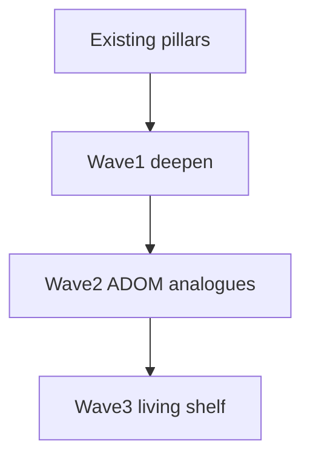

# Extraction Window — ADOM Depth (post-v1)

Roadmap to deepen toward ADOM feature richness **inside** the 15-sector extract spine. No towns, shops, overland, deity alignment, or cross-run meta.

**Canon:** [`V1.md`](V1.md) pillars · [`WORLD.md`](WORLD.md) ecology (scan pressure → EM → fauna) · [`ARCHITECTURE.md`](ARCHITECTURE.md) mechanic registry.

Each wave ships behind autopilot **55–85% WR**.

---

## ADOM → Meridian mapping

| ADOM classic | EW today | Richness target |
|--------------|----------|-----------------|
| Corruption | EM 0–100 + quiet | **Scan scars** at sustained EM-HIGH |
| Hunger | Bus drip | Keep bus primary; fatigue status as soft pressure |
| Identification | Single salvage | Tiered unknowns + biome/scavenger tables |
| Statuses | 4 | 8 with fauna/terrain/EM sources |
| Skills | 3×2 forks | Readable forks; later mastery track |
| Terrain | hazard/vent/scrub | Wave 2: traps, sealed hatches, pools |
| NPC quests | Hail + ally | Wave 2: agendas |
| Crafting | None | Wave 2: 2–3 field recipes |
| Brands | Flat equip | Situational equip tags (Wave 1) |
| Gods / alignment | Out | Soft doctrine later — not deities |
| Weather | Deferred | Wave 3 ion fronts |

---

## Wave 1 — Deepen without new pillars (this pass)

| Ticket | Status |
|--------|--------|
| Status pack: `blind` / `jam` / `fatigue` / `marked` | Done |
| Tiered salvage ID (`salvage` / `sealed_crate` / `array_shard`) | Done |
| Sustained EM-HIGH → scan scars | Done |
| Situational equip tags | Done |
| Re-enable `decode` in room-quest pool | Done |

**Exit gate:** unit + cohere + smoke + balance in band; scars/ID readable in log/HUD.

---

## Wave 2 — Mid-systems (Done)

| Ticket | Status |
|--------|--------|
| Terrain: `sealed` / `tripwire` / `brine_pool` / `scrub_nest` | Done |
| Field craft (sample→filter/ration, shard→balm) | Done |
| NPC agendas (ensign / tech / survey contact) | Done |
| Quiet vs Probe doctrine tallies | Done |
| Fauna `lightPrefer` dark/lit aggro | Done |

**Exit gate:** unit + cohere + smoke + balance in band; optional content never required for extract.

## Wave 3 — Living Shelf

| Ticket | Status |
|--------|--------|
| Elite/boss readable brands + deterministic branded kit drops | Done |
| Branded counter-kit: Flare Prism / Ward Weave / Shadow Lens | Done |
| Companion field roles: drone lamp/intercept + escort cover | Done |
| Ion fronts: mid/late temporary shear, EM/bus pressure, Quiet/filter/flare mitigation | Done |
| Content fattening: `relay_chain` re-enabled midgame with pattern-buffer fail-safe favor | Done |
| Deferred room quest: `calibrate` re-enabled late-mid/late with storm-shelter favor | Done |
| Deferred room quest: `stabilize` re-enabled midgame with hazard-pass favor | Done |
| Phaser Filters polish: optional built-in camera vignette + flare/ion/extract pulses | Done |

**Still out:** towns, shops, overland, deity worship, meta unlocks, engine rewrite.

**Wave 3 complete.** Camera filters are WebGL-only atmosphere; unsupported renderers keep the existing
Graphics/tint/light presentation. Sim light and FOV remain the gameplay source of truth.

### Relevance pass

Sealed hatches now refund a small storm window; brands alter flare, ion, and dark-aggro behavior;
ion fronts and contamination have clearer, sharper taxes; and Q3/P3 doctrine plus optional quest
favor previews make their thresholds and rewards visible. Texture-only scripted pulses were removed;
the optional quest route remains outside the extraction spine.

---

## Wave 4 — Craft & Coherence (in progress)

Depth of *craft* rather than new systems: lock the filters, bind optional text to real rooms, and make the mastery paths fail differently. Sourced from a design review against the sibling project `ruin-protocol`.

| Ticket | Status |
|--------|--------|
| Scope filter doc ([`GEM.md`](GEM.md)) + land [`DESIGN_PRINCIPLES.md`](DESIGN_PRINCIPLES.md) on main | Done |
| Doc drift: PLAN harness-only + Phaser 4; V1 quest table matches `pickRoomQuestKind` | Done |
| Locked look ([`art/ART_BIBLE.md`](art/ART_BIBLE.md)) — palette/emitter owners, chrome budget, rejects | Done |
| Feel debt: peek-teach yields to drill/tele hints; Notice Impact chase latch | Done — plus a single `resolveHintLine` channel so Escape cannot burn an unseen tip |
| `GameScene` shrink — extract remaining orchestration to presenters | Pending |
| Oracle telemetry: peak EM, IDs used, doctrine tallies, stuck reason codes | Done |
| Reporting personas (`stable` / `quiet` / `probe` / `reckless`) via `playtest --personas` | Done |
| Room facts → optional text binds to what is actually in the room; `cohere` fails unbound and unreachable pages | Done |
| Distinct failure modes per path (GEM §2) | **Measured — tuning deferred**, see below |

### Path-failure measurement (first read)

Full suite on `stable`: **19/30 (63%)**, hp 8 · storm 3 · energy 0 · stuck 0 — one channel owns **73%** of deaths. Persona sweep over smoke seeds:

| Persona | WR | Lose mix | Dominant | emPeak avg/max | Scars |
|---------|-----|----------|----------|----------------|-------|
| stable | 50% | hp 3, storm 1 | 75% | 25 / 44 | 0.0 |
| quiet | 50% | hp 3, storm 1 | 75% | 30 / 50 | 0.0 |
| probe | 38% | hp 5 | 100% | 25 / 49 | 0.0 |
| reckless | 50% | hp 1, storm 2, energy 1 | 50% | 22 / 40 | 0.0 |

Three findings for the tuning pass, in priority order:

1. **Scan scars are unreachable content.** Scars need `SCAR_STREAK_TURNS` (12) consecutive end-turns at `EM_HIGH` (65). Observed peak never exceeds **50** on any seed or persona, and EM has no passive decay — it is simply out-accumulated by purges (coolant, `purge`/`stabilize` quests, quiet doctrine). Either EM sources need to bite harder in late sectors or the scar streak needs to start below `EM_HIGH`.
2. **Quiet is not one option among several — it is the tax you must pay.** Dropping the jammer (`probe` persona) costs 12 points of win rate and makes deaths **100%** hp. That is a single curve with a mandatory item, not a doctrine choice.
3. **The bus clock is nearly dead as a channel.** Only `reckless` ever produced an energy loss. Bus pressure currently converts into hp deaths instead of its own failure.

Do **not** retune these from the oracle alone: the personas are reporting instruments, and the identify counts (0.6 per run) partly reflect how rarely the policy holds unknown salvage rather than how rare the content is. Pair the retune with human play, and re-gate `test:balance` after each step.

### POI content is unreachable

Found by the new fact-codex reachability check. POIs spawn only `if (!roomQuest && …)` in [`generator.ts`](../src/map/generator.ts), but a room quest always builds when a sector has three or more rooms — so **0 of 600 generated maps** (40 seeds x 15 sectors) contain a POI. The console / nest / cache-scar tile, its three log lines, its light emitter, `UI-HINT-POI`, and the pressure-reveal flicker are all dead.

Naively enabling it (45% roll on every map, POI kept off quest tiles) produced **44%** POI coverage and a healthier death mix (3 channels, dominant 50%, peak EM up to 61 — the nest is a real EM source), but cost **10 points of win rate (63% -> 53%, below band)** and wedged **5/30** seeds. Reverted; the branch is left in place with a comment.

Re-enabling needs its own pass: find why the policy wedges near POIs (likely repeated pathing to the nest), then rebalance for the band. Restore the three withheld POI pages (`CODEX-FACT-POI-NEST` / `-CACHE` / `-CONSOLE`, described in [`codex.ts`](../src/data/codex.ts)) in the same pass — `playtest:cohere` will fail them as unreachable until POIs exist.

**Not in Wave 4** (reviewed and rejected as wrong-project imports): React/Zustand HUD, fullscreen SDF or clustered lighting, cyber-psychosis / mutation fantasy, WFC megastructure generation, hub-every-5-sectors spine, cross-run meta of any kind.

**Exit gate:** unit + cohere + smoke + balance in band; no new always-on chrome; optional content still never required for extract.

---

## Guardrails

| Rule | Why |
|------|-----|
| `sim/` never imports Phaser | Keep oracle |
| No new Action per gimmick | ARCHITECTURE |
| Autopilot + `test:balance` 55–85% | Don't drown the policy |
| Optional content never required for extract | Causal spine stays clean |
| Lore IDs for every player string | LORE discipline |
| Deepen EM/light/kit before weather | Ecology thesis |

---

## Feel / onboarding

Human starts (`GameScene`) run a short **drill bay** tutorial (`tutorialActive`, `skipTutorial: false`) before real plains — not a 16th campaign sector. Harness / autopilot keep default `skipTutorial: true`. Storm clock and bus drip pause in the bay; hatch exit calls `finishTutorial` → load plains (afterglow fires once).
