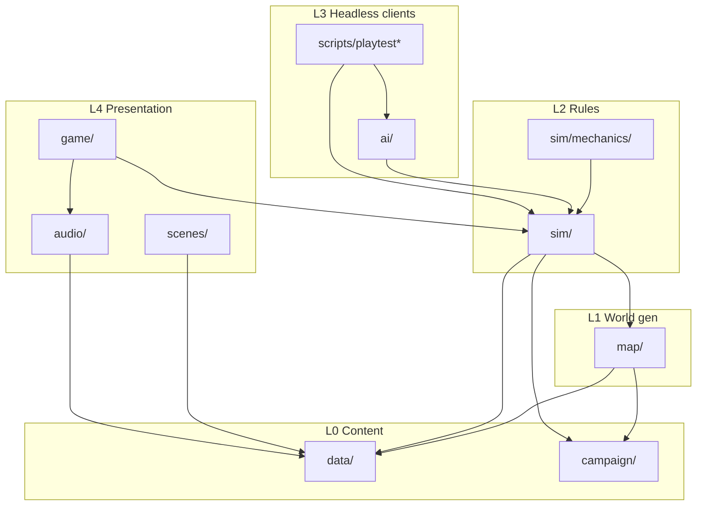

# Extraction Window — Architecture

Target shape for future mechanics (pattern buffer, quiet stance, beacon handshake, ion fronts). Keep the headless sim; shrink the Phaser shell.

## Layers



### Hard rules

1. **`sim/**` never imports Phaser, `game/`, `scenes/`, `audio/`, or `ai/`.**
2. **`data/` does not import `sim/`.**
3. **`ai/` imports only `sim` (+ `data` tables).**
4. **`game/` is the Phaser bridge** — `applyAction` + GameObjects live here (Boot texture bake excepted).
5. **Presenters call `audio/`; views do not play SFX.**
6. **Overlays read state + `lore()`; they do not mutate** — input issues `Action`s.
7. **Multi-turn systems register in `sim/mechanics/`** — `actions.ts` / `turn.ts` call the registry, not each mechanic by name.

## Directory map

| Path | Owns |
|------|------|
| `data/`, `campaign/`, `map/` | Content + generation |
| `sim/` | Rules, mutations, win/lose, logs |
| `sim/mechanics/` | Multi-step systems (hooks into action/turn) |
| `ai/` | Headless policy over `GameState` |
| `game/` | Input, HUD/map/overlays, feedback presenters |
| `scenes/` | Boot / Title / End + textures/theme/atmosphere |
| `audio/` | Web Audio buses |

## Mechanic contract

```ts
export interface Mechanic {
  id: string;
  tryAction?(state: GameState, action: Action): boolean;
  onEndTurn?(state: GameState): void;
  onSectorEnter?(state: GameState): void;
  modifyFov?(state: GameState, base: number): number;
  contextHint?(state: GameState): LoreId | null;
  autopilotHint?(state: GameState): Action | null;
}
```

- Prefer reusing `exit` / `wait` / `use` / `move` with phase on `GameState` over growing the `Action` union.
- Autopilot asks `autopilotHint` before generic pathing.
- HUD hints: `ContextHints` consults mechanics first.

## Presentation split

`scenes/GameScene.ts` is the Phaser `Scene` host. It should shrink toward an orchestrator; logic lives in:

| Module | Role |
|--------|------|
| `game/input/Keymap.ts` | Pure key → action / chrome commands |
| `game/presenters/ContextHints.ts` | State → lore hint |
| `game/presenters/ActionFeedback.ts` | SFX, flashes, move tweens (target) |
| `game/views/HudView.ts` | Bars, badges, log, objective |
| `game/views/MapView.ts` | FOV frame / map chrome |
| `game/views/overlays/*` | Kit / PADD / Help panels |

**Pull-sync:** after every `applyAction`, views read `GameState`. No shadow rules in the scene. Autopilot-visible UI (`inventoryOpen`, `aimingDart`, `skillPick`, future handshake) stays on `GameState`.

## Migration

| Step | Status | Notes |
|------|--------|--------|
| PR1 — Extract `game/` views / keymap / hints | Done | Behavior-identical; playtests green |
| PR2 — `InputController` + `ActionFeedback` | Next | Move `onKey` / SFX / tweens out of GameScene |
| PR3 — Mechanic registry + room quest behind hooks | Done | Multiroom quests + trio + scripted events |
| PR4 — First new mechanic (beacon handshake) | Done | Multi-turn sync; interrupt on leave |

Each step: `npm run build && npm run playtest:smoke` (full `playtest` before merge).

## Do not

- Full ECS / Redux / React HUD beside Phaser
- Animation state in `GameState`
- Meta unlocks / cross-run progression
- One-off `Action` keys per mechanic when `exit`/`wait` suffice
- Big-bang GameScene rewrite in one PR
- Import `game/` from `sim/`
