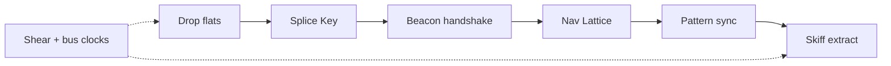

# Extraction Window — First Version (v1)

Prototype → shippable first version. Canon and cut list for what ships; later fiction/systems work follows this doc.

**Related:** [`WORLD.md`](WORLD.md) (glossary / ecology) · [`LORE.md`](LORE.md) (mission bible) · [`ARCHITECTURE.md`](ARCHITECTURE.md) (layers) · [`ADOM_DEPTH.md`](ADOM_DEPTH.md) (post-v1 ADOM richness) · [`../PLAN.md`](../PLAN.md) (build/balance — Halcyon framing; points here + WORLD)

---

## Pitch

**One sentence:** Solo turn-based sci-fi ADOM-lite — Halcyon Survey Corps drop on Meridian Shelf; recover a spare **Nav Lattice** and extract via drop skiff before the **shear window** and **bus** clocks kill you.

**Fantasy:** Prior team’s field array never shut down cleanly. Residual scan pressure keeps ecology hot. Your **field lamp / flares** are how you work the Shelf without waking everything.

**Tone:** Terse field logbook + conflicting prior PADDs. No franchise names, no towns/shops/meta unlocks.

---

## Pillars (identity — do not cut)

| Pillar | Player experience | Foundation |
|--------|-------------------|------------|
| Dual clocks | Race the shear window; manage bus/energy | `src/sim/turn.ts`, `src/campaign/spine.ts` (`STORM_TURNS=700`) |
| Causal extract | Key → handshake → Lattice → pad (legal win) | `objectives.ts`, `beaconHandshake`, `patternBuffer` |
| Field light | Lamp/flare change combat outcomes, not just tint | `src/sim/light.ts`, dart / `inShadow` hooks |
| Kit + pressure | Consumables, tool + armor equip, EM, hazards | `inventory.ts`, `emStress.ts` |
| In-run mastery | Levels 1–8, skill forks; no meta | `src/data/progression.ts` |
| Headless truth | Sim owns rules; Phaser presents | `docs/ARCHITECTURE.md` |

**Core loop (every turn):** move/bump/use → environment drip → mechanics tick → FOV+light → enemy/ally AI → lose checks.

---

## Engine (locked)

Rules live in headless TypeScript `sim/` with Vitest + autopilot as the balance oracle (55–85% WR). The engine is **presentation only**.

| Decision | Detail |
|----------|--------|
| **v1 engine** | Stay on **Phaser** + Vite + Vitest |
| **Upgrade** | **Done** — Phaser **4.2.1** (`phaser@^4.2.1`). No custom WebGL pipelines; field light stays sim → `LightView` tint/bloom (not Phaser Light2D). Config already sets `roundPixels: true` (v4 default is false). |
| **Fallback** | Hold Phaser 3 only if migrate blocked — not needed |
| **Reject for v1** | Godot, Unity WebGL, Excalibur rewrite, Pixi-only shell, Kaplay/melonJS |
| **Post-v1** | Wrap same web build (itch / Playables / optional Tauri) before any native rewrite; optional Filters / native lighting polish if art pass wants it |

`sim/` remains Phaser-free. No mid-v1 engine swap.

---

## Content shape

Keep the **15-sector fixed spine**. Sector display names 0–14 are Meridian-complete (WORLD Phase 2).

| Layer | Prototype | v1 intent |
|-------|-----------|-----------|
| Sectors | 15 biomes | Keep 15; polish names/logs/tells |
| Enemies | ~22 + elites/bosses | Keep food-chain + 3 bosses |
| Items | 18 kinds | One clear tool per job; retired kinds folded onto the survivor that did their work |
| Optional depth | 3 room-quest kinds, NPCs | See **Room quests** below |
| Skills | 3 forks × 2 | Keep; make each fork readable in HUD/logs |

---

## Cut list

### Keep (ship)

- Sim action API, FOV, illumination, combat absorb, inventory/equip
- Mechanic registry: handshake, pattern buffer, EM
- Autopilot + `test:balance` **55–85% WR**
- Lore-id string discipline; dual clocks; legal win asserts
- Field light gameplay (flare sources, lit darts, shadow ambush)

### Reshape

- Meridian chrome pass (lore + sector/enemy display; README + PLAN aligned)
- Room quests — prune kinds (below)
- Scripted events — keep prior-crew conflict + sector pulses that teach pillars
- Difficulty — combat depth via `difficulty.ts` (progress storm/energy tax stubs removed Wave 6)
- Presentation — GameScene PR2 (`InputController` + `ActionFeedback`) — **done**; Phaser 4 — **done**

### Kill / defer (not v1)

- Towns, shops, overland map, alignment, cross-run meta
- Real-time physics, knockback, light replacing FOV explore
- Full ion-front weather system
- New `Action` variants for every gimmick (reuse exit/wait/use/move + state phases)
- Engine rewrite (Godot/Unity/etc.)

---

## Room quests

**Status:** three kinds, one global pool ([`pickRoomQuestKind`](../src/sim/roomQuest.ts)). Each bills a
different resource, so the choice of whether to detour is a real one, and each pays a distinct
extraction favor. `decode`, `relay_chain`, `stabilize` and `calibrate` were cut: relay_chain was pure
walking, stabilize duplicated vent_seal's "spend sealant at a site", and calibrate was a timer bolted
onto the same routing.

| Kind | Costs | Favor | Why |
|------|-------|-------|-----|
| `salvage` | Window time | `storm_shelter` | Teaches kit/loot; low cognitive load |
| `purge` | HP | `hazard_pass` | Teaches combat wake + light/aggro under pressure |
| `vent_seal` | Kit (sealant), two sites | `pattern_fail_safe` | Teaches sealant + vent/EM; fits the Meridian bus/hazard fantasy |

Depth changes the danger, not the ask: every sector draws from the same three.

**Survey / NPCs:** optional room quests refund Window; NPCs as lore/ally hail only (not required for extract). Mid-room / hatch survey refunds cut in Wave 6.

**Guardrail unchanged:** optional quests never gate extract, and the pool only changes while `test:balance` holds the 55–85% WR band.

---

## Player journey (acceptance)

1. Title/brief reads Halcyon / Meridian (no franchise residue).
2. Early flats/basin: lamp, flare, quiet are *meaningful*.
3. Spine clear from HUD objectives without a wiki.
4. One optional room quest feels rewarding, never required.
5. Key → beacon hold → Lattice → pattern care → pad in one sitting (~90–120 min storm budget).
6. Losses readable (HP / bus / window); autopilot WR stays in band.

---

## Fiction audit (Phase 2 status)

Player-facing leftovers vs WORLD glossary. Internal IDs (`relay_key`, `nav_core`, sector ids) stay.

### Hard franchise / jargon in player strings — **done**

| Location | Was | Now |
|----------|-----|-----|
| `index.html` `<title>` | Voyager Away Ops | Extraction Window — Halcyon Survey |
| `SEC-DUCT` / enter log | EPS Conduit Warren | Bus Conduit Warren |
| `ENEMY-WARDEN` | Isolinear Warden | Splice Warden |
| `src/sim/status.ts` ion log detail | `… EPS` | `… bus` |
| `CODEX-TECH` / `ALLY-DRONE` / `LOG-NPC-TECH` | Type-8 probe | Halcyon probe |

### Sector display names (2–14) — **done**

| # | ID | Name |
|---|-----|------|
| 2 | canopy | Shear Canopy |
| 3 | reef | Crystal Pulse Reef |
| 4 | spire | Array Mast Reach |
| 5 | ruin | Crash Wreck Belt |
| 6 | beacon | Emergency Beacon |
| 7 | trench | Inland Fault Cut |
| 8 | duct | Bus Conduit Warren |
| 9 | ash | Shear Ash Fields |
| 10 | brine | Pulse Brine Flats |
| 11 | vault | Contingency Cache |
| 12 | fissure | Shear Fissure |
| 13 | approach | Skiff Approach |
| 14 | ridge | Drop Skiff Ridge |

Sectors **0–1** already Meridian-voiced (Relay Scar Flats / Shearwash Basin). Enter logs (`LOG-SEC-*`) match.

### Hostile / note polish — **partial**

- `ENEMY-LEECH` → Shear Leech; CODEX brine/reef “nucleonic” softened to pulse.
- Remaining mid/late names still generic sci-fi (`Plasma Serpent`, `Security Drone`, etc.) — optional further Meridian ecology pass; not blocking ship gate if no franchise trademarks.

### Docs / comments — **done (touched)**

| Location | Status |
|----------|--------|
| `PLAN.md` | Rewritten to Halcyon / Meridian; points at V1 + WORLD |
| `theme.ts` / `textures.ts` comments | Cleared Voyager LCARS / Delta / Isolinear wording |
| Test `it()` titles | hypospray → field hypo; Isolinear Key → Splice Key; EPS → bus |
| Code comments (`EPS drip`, `Type-9`, `Nav Core`) | Still present in some sim internals — non-player; clean opportunistically |

### Remaining (not Phase 2 blockers)

- Phase 4 presentation PR2 — **done**; Phase 5 Phaser 4 — **done** (`phaser@4.2.1`)
- Optional deeper enemy/display Meridian polish beyond franchise kills
- Opportunistic comment cleanup in `sim/` (`EPS drip` notes)

---

## Ship gates (definition of done)

| Gate | Criteria |
|------|----------|
| Fiction | No Voyager/Starfleet/Delta/Isolinear/Type-9/tricorder/hypospray in **player** strings; sectors 0–14 Meridian-named; EPS only as internal id or renamed to bus in HUD/logs |
| Spine | Autopilot + human legal-win; `playtest:cohere` green |
| Systems | Light + quiet + handshake + pattern each change outcomes and are hinted |
| Quests | Active pick pool documented in **Room quests** and matching `pickRoomQuestKind`; no quest gates extract |
| Balance | `test:balance` **55–85%** WR; mixed lose channels (hp + storm min); stuck &lt;20% — **met:** **63% WR** (19/30), hp+storm present, stuck 0% |
| Feel | Title → drill bay → drop → extract in browser; HUD coaching for kit/light/spine |
| Architecture | `sim/` Phaser-free; GameScene not grown without extract (PR2) |
| Engine | Phaser **4.2.1** on Vite; no mid-v1 engine rewrite |

**Commands:** `npm run playtest:cohere`, `npm run test:unit`, `npm run playtest:smoke`, `npm run test:balance`, `npm run build`.

---

## Work phases (after this doc)

1. **Canon lock** — This file + README aligned; glossary freeze in WORLD.
2. **Fiction complete** — Sector 2–14 names/logs + leftover franchise strings — **done** (this pass).
3. **Systems prune** — Room-quest pool cut to three; kit cut to 18 kinds; `get`/`retreat` verbs dropped — **done**.
4. **Presentation PR2** — InputController / ActionFeedback extract — **done** (this pass).
5. **Phaser 4 migrate** — **Done** (`^3.87` / resolved 3.90 → **4.2.1**); build + unit green; no API rewrites required.
6. **Playtest harden** — **Done** (this pass). Autopilot green; no difficulty retune (WR in band). Tag not cut — **ready to tag** when you want a release marker.

---

## Phase 6 — Playtest harden (results)

| Check | Result |
|-------|--------|
| `playtest:cohere` | PASS — 15 sectors, 21 enemies, 18 items, lore keys ok |
| `test:unit` | PASS — 31 files / 310 tests |
| `playtest:smoke` | PASS — 0 crashes, illegal=0 |
| `test:balance` / full `playtest` | PASS — **19/30 wins (63% WR)**; 61.5% ±6.7 over 200 fresh seeds (`scripts/probe-wr.ts`) |
| Lose mix | hp=7, storm=0, energy=2, stuck=0 (stuck **0%** of suite); hp owns 76% over 300 seeds |
| `build` | PASS — `tsc --noEmit` + Vite production build |
| Difficulty retune | **None** — combat depth left as-is; storm/energy progress taxes still off |

**Ship gates:** Fiction / spine / systems / quests / balance / architecture / engine gates look met on headless oracle + build. Feel gate (browser title→drop→extract) is manual — not blocked by autopilot.

**Tag:** Not created. Suite is **ready to tag** (e.g. `v1.0.0`) when desired.

---

## Explicit out of v1

Art retheme, audio redesign, campaign-length change, Godot/Unity port, meta progression, ion-front weather.
