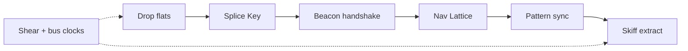

# Extraction Window — First Version (v1)

Prototype → shippable first version. Canon and cut list for what ships; later fiction/systems work follows this doc.

**Related:** [`WORLD.md`](WORLD.md) (glossary / ecology) · [`LORE.md`](LORE.md) (mission bible) · [`ARCHITECTURE.md`](ARCHITECTURE.md) (layers) · [`../PLAN.md`](../PLAN.md) (build/balance — **stale franchise framing**; treat this doc + WORLD as truth)

---

## Pitch

**One sentence:** Solo turn-based sci-fi ADOM-lite — Halcyon Survey Corps drop on Meridian Shelf; recover a spare **Nav Lattice** and extract via drop skiff before the **shear window** and **bus** clocks kill you.

**Fantasy:** Prior team’s field array never shut down cleanly. Residual scan pressure keeps ecology hot. Your **field lamp / flares / quiet stance** are how you work the Shelf without waking everything.

**Tone:** Terse field logbook + conflicting prior PADDs. No franchise names, no towns/shops/meta unlocks.

---

## Pillars (identity — do not cut)

| Pillar | Player experience | Foundation |
|--------|-------------------|------------|
| Dual clocks | Race the shear window; manage bus/energy | `src/sim/turn.ts`, `src/campaign/spine.ts` (`STORM_TURNS=700`) |
| Causal extract | Key → handshake → Lattice → pad (legal win) | `objectives.ts`, `beaconHandshake`, `patternBuffer` |
| Field light | Lamp/quiet/flare change combat outcomes, not just tint | `src/sim/light.ts`, dart / `inShadow` hooks |
| Kit + pressure | Consumables, 3-slot equip, EM, quiet, hazards | `inventory.ts`, `emStress.ts` |
| In-run mastery | Levels 1–8, skill forks; no meta | `src/data/progression.ts` |
| Headless truth | Sim owns rules; Phaser presents | `docs/ARCHITECTURE.md` |

**Core loop (every turn):** move/bump/use → environment drip → mechanics tick → FOV+light → enemy/ally AI → lose checks.

---

## Engine (locked)

Rules live in headless TypeScript `sim/` with Vitest + autopilot as the balance oracle (55–85% WR). The engine is **presentation only**.

| Decision | Detail |
|----------|--------|
| **v1 engine** | Stay on **Phaser** + Vite + Vitest |
| **Upgrade** | Migrate Phaser **3 → 4** after GameScene PR2 extract (Filters / lighting / tile path) |
| **Fallback** | Hold Phaser 3 if migrate slips; document in ship notes |
| **Reject for v1** | Godot, Unity WebGL, Excalibur rewrite, Pixi-only shell, Kaplay/melonJS |
| **Post-v1** | Wrap same web build (itch / Playables / optional Tauri) before any native rewrite |

`sim/` remains Phaser-free. No mid-v1 engine swap.

---

## Content shape

Keep the **15-sector fixed spine**. Finish Meridian rename for sectors 2–14 and remaining hostile display names (WORLD Phase 2).

| Layer | Prototype | v1 intent |
|-------|-----------|-----------|
| Sectors | 15 biomes | Keep 15; polish names/logs/tells |
| Enemies | ~22 + elites/bosses | Keep food-chain + 3 bosses |
| Items | 25 kinds | Keep quest + core kit; trim low-use later via playtest |
| Optional depth | 7 room-quest kinds, survey, NPCs | See **Room quest prune** below |
| Skills | 3 forks × 2 | Keep; make each fork readable in HUD/logs |

---

## Cut list

### Keep (ship)

- Sim action API, FOV, illumination, combat absorb, inventory/equip
- Mechanic registry: handshake, pattern buffer, quiet, EM
- Autopilot + `test:balance` **55–85% WR**
- Lore-id string discipline; dual clocks; legal win asserts
- Field light gameplay (quiet dim, flare sources, lit darts, shadow ambush)

### Reshape

- Meridian chrome pass (lore + sector/enemy display; README done; PLAN.md still stale)
- Room quests — prune kinds (below)
- Scripted events — keep prior-crew conflict + sector pulses that teach pillars
- Difficulty — combat depth via `difficulty.ts`; progress storm/energy taxes stay off until WR has headroom
- Presentation — GameScene PR2 (`InputController` + `ActionFeedback`); then Phaser 4

### Kill / defer (not v1)

- Towns, shops, overland map, alignment, cross-run meta
- Real-time physics, knockback, light replacing FOV explore
- Full ion-front weather system
- New `Action` variants for every gimmick (reuse exit/wait/use/move + state phases)
- Engine rewrite (Godot/Unity/etc.)

---

## Room quest prune

Generator still *can* emit all kinds until systems-prune implements the cut. **v1 product intent:**

| Kind | v1 | Why |
|------|-----|-----|
| `salvage` | **Keep** | Teaches kit/loot; low cognitive load |
| `purge` | **Keep** | Teaches combat wake + light/aggro under pressure |
| `vent_seal` | **Keep** (multi-site) | Teaches sealant + vent/EM; fits Meridian bus/hazard fantasy |
| `relay_chain` | **Defer** | Overlaps vent/salvage multi-site; park until post-v1 depth pass |
| `calibrate` | **Defer** | Timer multi-site; optional complexity without spine teaching |
| `decode` | **Defer** | Passive-on-tile busywork; weak pillar link |
| `stabilize` | **Defer** | Sealant overlap with vent_seal; consolidate into vent_seal |

**Survey / NPCs:** keep survey as soft storm/XP refund; NPCs as lore/ally hail only (not required for extract).

**Implementation note (later phase):** narrow `pickRoomQuestKind` to `salvage | purge | vent_seal`; leave deferred kinds in code for a depth pass, or gate behind a flag — do not delete data IDs blindly.

---

## Player journey (acceptance)

1. Title/brief reads Halcyon / Meridian (no franchise residue).
2. Early flats/basin: lamp, flare, quiet are *meaningful*.
3. Spine clear from HUD objectives without a wiki.
4. One optional room quest feels rewarding, never required.
5. Key → beacon hold → Lattice → pattern care → pad in one sitting (~90–120 min storm budget).
6. Losses readable (HP / bus / window); autopilot WR stays in band.

---

## Fiction audit (remaining rename targets)

Player-facing leftovers vs WORLD glossary. Internal IDs (`relay_key`, `nav_core`, sector ids) stay.

### Hard franchise / jargon in player strings

| Location | Current | Target |
|----------|---------|--------|
| `index.html` `<title>` | Voyager Away Ops | EXTRACTION WINDOW / Halcyon |
| `SEC-DUCT` / enter log | EPS Conduit Warren | Bus Conduit Warren (or Meridian warren name) |
| `ENEMY-WARDEN` | Isolinear Warden | Splice Warden / Cache Warden (avoid Isolinear) |
| `src/sim/status.ts` ion log detail | `… EPS` | `… bus` / Power |
| `CODEX-TECH` | Type-8 probe | field probe / Halcyon probe |

### Sector display names still template / Phase-1 incomplete (2–14)

| # | ID | Current lore name | v1 rename intent (suggest; finalize in fiction pass) |
|---|-----|-------------------|------------------------------------------------------|
| 2 | canopy | Canopy Sector | Shear Canopy / Mast-scatter Canopy |
| 3 | reef | Nucleonic Reef | Crystal Pulse Reef |
| 4 | spire | Sensor Mast Reach | keep or Array Mast Reach |
| 5 | ruin | Crash Wreck Belt | keep (works in Meridian) |
| 6 | beacon | Emergency Beacon | keep |
| 7 | trench | Fault Corridor | keep or Inland Fault Cut |
| 8 | duct | EPS Conduit Warren | **Bus Conduit Warren** |
| 9 | ash | Radiogenic Ash | Shear Ash Fields |
| 10 | brine | Nucleonic Brine | Pulse Brine Flats |
| 11 | vault | Contingency Cache | keep |
| 12 | fissure | Gravimetric Fissure | Shear Fissure |
| 13 | approach | Pad Approach | Skiff Approach |
| 14 | ridge | Shuttle Ridge | Drop Skiff Ridge |

Sectors **0–1** already Meridian-voiced (Relay Scar Flats / Shearwash Basin).

### Hostile / note polish (optional in fiction pass)

Early chain (mite/spore/wasp) done. Mid/late still generic sci-fi (`Ion Leech`, `Nucleonic` leftovers in notes). Prefer Meridian ecology language over franchise scanner words.

### Docs / comments (not player-facing — clean when touched)

| Location | Issue |
|----------|--------|
| `PLAN.md` | Full Voyager / Type-9 / Isolinear framing — rewrite to point at V1 + WORLD |
| `theme.ts` / `textures.ts` comments | “Voyager LCARS”, “Delta survey” |
| Test descriptions | “hypospray”, “Isolinear Key”, “EPS” in `it()` titles |
| Code comments | “Nav Core”, “Type-9”, “EPS drip” |

---

## Ship gates (definition of done)

| Gate | Criteria |
|------|----------|
| Fiction | No Voyager/Starfleet/Delta/Isolinear/Type-9/tricorder/hypospray in **player** strings; sectors 0–14 Meridian-named; EPS only as internal id or renamed to bus in HUD/logs |
| Spine | Autopilot + human legal-win; `playtest:cohere` green |
| Systems | Light + quiet + handshake + pattern each change outcomes and are hinted |
| Quests | Only salvage / purge / vent_seal in active pick pool (or equivalent documented hold) |
| Balance | `test:balance` **55–85%** WR; mixed lose channels (hp + storm min); stuck &lt;20% |
| Feel | Title → drop → extract in browser; HUD coaching for kit/light/spine |
| Architecture | `sim/` Phaser-free; GameScene not grown without extract (PR2) |
| Engine | Phaser 4 on Vite (or documented Phaser 3 hold); no mid-v1 engine rewrite |

**Commands:** `npm run playtest:cohere`, `npm run test:unit`, `npm run playtest:smoke`, `npm run test:balance`, `npm run build`.

---

## Work phases (after this doc)

1. **Canon lock** — This file + README aligned; glossary freeze in WORLD.
2. **Fiction complete** — Sector 2–14 names/logs + leftover franchise strings above.
3. **Systems prune** — Room-quest pick pool; scripted-event pass; pillar hints.
4. **Presentation PR2** — InputController / ActionFeedback extract.
5. **Phaser 4 migrate** — Bump, fix breakages, Filters/lighting for field-light readability.
6. **Playtest harden** — Manual + autopilot; retune difficulty only if WR drifts; tag first version.

---

## Explicit out of v1

Art retheme, audio redesign, campaign-length change, Godot/Unity port, meta progression, ion-front weather.
